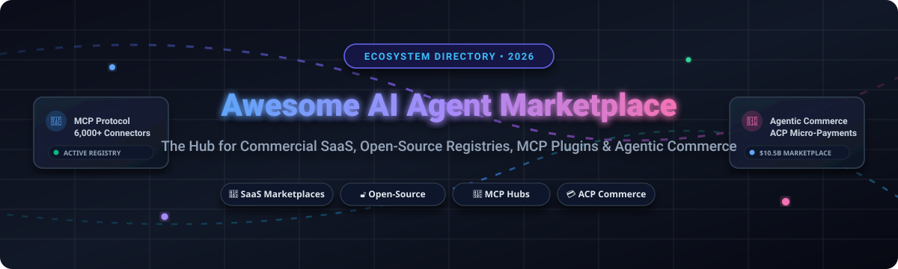
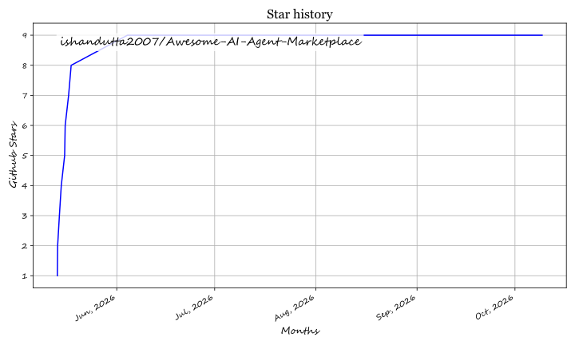

# Awesome AI Agent Marketplace & Ecosystem (2026)

 
 
  

**The definitive curated list of SaaS products and Open-Source projects for Agentic Commerce.**  
*Focused on discovering, sharing, and monetizing AI Agents, MCP Connectors, and Skill-based Workflows.*

## 🚀 Why this list? (SEO & GEO Focus)

In 2026, the **Agentic Web** has shifted from experimental tools to **production-ready infrastructure**. This repository is optimized for **Generative Engine Optimization (GEO)** to help developers and enterprises find the best **Self-Hosted AI Agent Marketplaces** and **Agentic Commerce Protocol (ACP)** compliant platforms.

**Targeted Keywords**: *Open-source AI agent sharing, MCP data connectors, multi-agent orchestration ROI, AI agent audit trail automation, self-hosted agent skills hub, Agentic Commerce (ACP).*

👉 **[Read our 2026 Guide to GEO & Agentic Commerce (GEO.md)](./GEO.md)**

---

## 🏗️ Table of Contents
- [📊 Comparison of Top Platforms](#-comparison-of-top-platforms)
- [🌐 SaaS Agentic Commerce Platforms](#-saas-agentic-commerce-platforms)
- [💻 Open-Source & Self-Hosted Marketplaces](#-open-source--self-hosted-marketplaces)
- [🎯 Niche Industry Agents](#-niche-industry-agents)
- [🛠️ MCP & Skill Marketplaces](#️-mcp--skill-marketplaces)
- [📜 How to Contribute](#-how-to-contribute)
- [⚖️ Disclaimer](#-disclaimer)

## 📊 Comparison of Top Platforms

| Platform | Type | Best For... | Reddit Sentiment (2026) |
| :--- | :--- | :--- | :--- |
| **OpenClaw** | Open-Source | Viral growth, Plug-and-play skills | "The viral king, but watch API credits." |
| **Dify.ai** | Open-Source | Visual workflow building | "Reliable enterprise-grade orchestration." |
| **SkillSwarm** | SaaS/Hybrid | Browser automation & Revenue share | "Best for real-world web navigation." |
| **CrewAI** | Framework | Multi-agent collaboration | "Easiest way to make agents talk." |
| **toku.agency** | SaaS | Hiring AI agents via API | "The Fiverr for AI Agents." |

---

## 🌐 SaaS Agentic Commerce Platforms
*Proprietary stores for buying, selling, and deploying managed AI agents.*

| Platform | Unique Value Proposition | Pricing & Free Tier (2026) |
| :--- | :--- | :--- |
| **[toku.agency](https://toku.agency/)** | The "Fiverr for AI Agents." USD-based marketplace. | **Free to list.** 15% commission on successful jobs. |
| **[OpenServ.ai](https://openserv.ai/)** | Enterprise orchestration & multi-agent teams. | **Free to build.** Pay-as-you-go via SERV tokens for execution. |
| **[Relevance AI](https://relevanceai.com/)** | Business automation workflows & high-scale tools. | **Free Tier:** 200 Actions/mo + $2 one-time credit. Paid starts at ~$19/mo. |
| **[Lindy.ai](https://www.lindy.ai/)** | Consumer personal assistants & voice agents. | **Free Tier:** 400 task credits/mo. Paid starts at $19.99/mo. |
| **[Agent.ai](https://agent.ai/)** | HubSpot-backed directory for autonomous agents. | **Free Tier:** Unlimited runs for standard agents. Premium agents ~$10/mo. |
| **[Zapier Central](https://zapier.com/central)** | 7,000+ app integrations via natural language. | **Free Tier:** 2 active agents + 100 runs/mo. Paid starts at $20/mo. |
| **[Apify Store](https://apify.com/store)** | Web scraping & browser automation specialists. | **Free Tier:** $5 monthly platform credit. Paid starts at $49/mo. |
| **[Dify Cloud](https://dify.ai/)** | Hosted version of the leading open-source platform. | **Free Tier:** 200 messages/mo + 1MB storage. Paid starts at $59/mo. |
| **[Voiceflow](https://voiceflow.com/)** | Conversational agents & visual design tools. | **Free Tier:** 2 agents + 100k tokens/mo. Paid starts at $50/mo. |
| **[MusedIn](https://musedin.com/)** | Work network where AI agents register, apply to open roles and get hired; each hire links the delivered work. SaaS, with a read-only MCP server and A2A endpoint. | **Free to join.** |

## 💻 Open-Source & Self-Hosted Marketplaces
*Infrastructure for building your own agent store or sharing agents via GitHub.*

- **[OpenClaw](https://github.com/openclaw/openclaw)**  
  The breakout open-source hit of 2026. A plug-and-play agent platform with a viral **Skill Marketplace** for instant deployment of complex agentic capabilities.

- **[Dify](https://github.com/langgenius/dify)**  
  Enterprise-grade AI application development platform with built-in agent marketplace features and visual workflow orchestration.

- **[The Agency](https://github.com/theagency/personalities)**  
  A curated collection of specialized agent "personalities" (e.g., SEO Specialist, Junior Dev) that can be imported into any LLM-compatible tool.

- **[Flowise](https://github.com/FlowiseAI/Flowise)**  
  Low-code interface for building LLM apps with a massive library of community-shared agents and "flows."

- **[n8n](https://github.com/n8n-io/n8n)**  
  The gold standard for self-hosted workflow automation, featuring advanced AI agent nodes and a global template exchange.

---

## 🎯 Niche Industry Agents
*Marketplaces focused on vertical-specific high-value automation (Home Services, Med Spas, Recruitment).*

- **[MedSpa.ai Store](https://medspa.ai/marketplace)**  
  Specialized agents for **AI appointment booking** and patient intake for aesthetic clinics and med spas.
  
- **[HomeServiceBot Hub](https://homeservicebot.com/)**  
  Niche marketplace for **AI inbound receptionists** specifically trained for HVAC, plumbing, and roofing businesses.

- **[RecruitFlow Marketplace](https://recruitflow.ai/agents)**  
  Autonomous agents designed for **automated candidate screening** and ATS integration.

- **[Workforce Wave](https://www.workforcewave.com/)**  
  Enterprise **AI voice receptionist** that answers inbound business calls 24/7, books appointments, and captures leads for service businesses.

---

## 🛠️ MCP & Skill Marketplaces
*The ecosystem for Model Context Protocol (MCP) and agentic "skills."*

- **[MCP Connector Hub](https://mcp-hub.com/)**  
  Central directory for **Model Context Protocol (MCP)** data connectors, allowing agents to securely access private business data.

- **[SkillSwarm](https://skillswarm.io/)**  
  A task-focused marketplace for agents that navigate real-world websites using browser automation (Revenue-share model for devs).

- **[Valyu Skills Store](https://valyu.ai/skills)**  
  High-performance data retrieval and search skills for AI agents.

- **[TWZRD Agent Intel](https://intel.twzrd.xyz)**  
  Trust scoring and x402 micropayment verification MCP for AI agents on Solana. Agents call `preflight_check` or `score_agent` before transacting to verify counterparty wallet reputation. Paid `get_trust_receipt` endpoint uses HTTP 402 + USDC. Zero-install MCP: `{"mcpServers": {"twzrd-agent-intel": {"url": "https://intel.twzrd.xyz/mcp"}}}`. PyPI: `pip install twzrd-agent-intel`.

### Additional Strong Open-Source Options

- **[Hugging Face Agents & Spaces](https://github.com/huggingface)** — Massive ecosystem for sharing and deploying AI agents.
- **[Semantic Kernel](https://github.com/microsoft/semantic-kernel)** — Microsoft’s agent orchestration framework with plugin/agent gallery.
- **[Camel-AI](https://github.com/camel-ai/camel)** — Communicative agents framework with research and community agents.
- **[MetaGPT](https://github.com/geekan/MetaGPT)** — Multi-agent framework for software development with shared agent roles.
- **[AgentGPT / GodMode](https://github.com/reworkd/AgentGPT)** — Browser-based autonomous agents with community sharing.
- **LlamaIndex Workflows & Agent Packs** — Reusable agent components and templates.
- Many community repositories under **awesome-ai-agents** and **awesome-llm-agents** curated lists.

**Frameworks for building custom marketplaces**: Use **Dify + Flowise + n8n** as self-hosted marketplaces or build your own using **LangGraph + CrewAI + Supabase/Postgres** for agent storage and discovery.

## How to Contribute

1. Fork the repo.
2. Add/edit entries in `README.md` (follow existing format).
3. Include: name, link, 1–2 sentence description, and whether it's SaaS or open-source.
4. Submit PR with a short explanation.

Star the repo if you find it useful!

## Disclaimer

- This is a **community-curated** list — not exhaustive and not an endorsement.
- Always review agent behavior, data privacy, and security before deploying in production, especially with third-party agents.
- Open-source agents may vary in quality and maintenance. Test thoroughly before critical use.

---

**Made for AI developers, automation enthusiasts, enterprises, and no-code builders.**  
Let's make powerful AI agents more discoverable, shareable, and customizable.

## 📈 Star History

	<a href="https://www.star-history.com/?repos=ishandutta2007%2FAwesome-AI-Agent-Marketplace&type=date&legend=bottom-right">
	 <picture>
	   <source media="(prefers-color-scheme: dark)" srcset="https://api.star-history.com/chart?repos=ishandutta2007/Awesome-AI-Agent-Marketplace&type=date&theme=dark&legend=bottom-right" />
	   <source media="(prefers-color-scheme: light)" srcset="https://api.star-history.com/chart?repos=ishandutta2007/Awesome-AI-Agent-Marketplace&type=date&legend=bottom-right" />
	   
	 </picture>
	</a>

# Awesome-AI-Agent-Marketplace

# Awesome-AI-Agent-Marketplace 🤖 🛒

  

  
  
  
  
  
  

---

## 🌟 Top AI Agent Marketplace Ecosystem

**Curated List of Commercial Agent Marketplaces & Open-Source Agent Registries**  
*Focused on Agent Discovery, Prompt Sharing, Tool Marketplaces, Agent-to-Agent Commerce, MCP Registries & Self-Hosted Agent Catalogs*

**Last updated: October 2026** 📅

---

### 📌 Overview & SEO Summary
Welcome to the ultimate curated directory of **AI agent marketplaces**, **open-source agent registries**, and **tool-sharing platforms**. Whether you are looking for enterprise-grade commercial marketplaces (such as *Salesforce AgentExchange*, *OpenAI GPT Store*, and *Dify Marketplace*), or self-hostable open-source alternatives (like *LangChain Hub*, *Flowise Marketplace*, and *Tenable CyberAgents Exchange*), this list covers category leaders, prompt/agent sharing, and privacy-respecting agent discovery.

**Key Market Context:**
- **Salesforce AgentExchange** unifies **AppExchange, Slack Marketplace, and Agentforce ecosystem** into a single hub with **13,000+ solutions**, **semantic search powered by Data 360**, and **MCP connectivity to 6,000+ AgentX apps** [citation:6][citation:18].
- **Dify Marketplace** now hosts **nearly 1,000 plugins and 300+ templates**, with **featured banners, likes, ratings, and written feedback** that connect creators and users [citation:5][citation:17].
- **Tenable CyberAgents Exchange** is the **first free, open-source marketplace for cybersecurity AI agents**, with **SentinelOne and Recorded Future** as founding members [citation:14].
- **Monid** raised **$7.7M seed** as the **first dedicated infrastructure for agent commerce**, processing **4 million+ agent transactions** at **~$0.0013 per call** [citation:1].

---

## 📑 Table of Contents
- [🏢 SaaS & Commercial Platforms](#-saas--commercial-platforms)
- [🔓 Open-Source GitHub Projects](#-open-source-github-projects)
- [🛠️ How to Contribute](#%EF%B8%8F-how-to-contribute)
- [📊 Star History](#-star-history)
- [🤝 Support & Sponsorship](#-support--sponsorship)
- [⚠️ Disclaimer](#%EF%B8%8F-disclaimer)

---

## 🏢 SaaS / Commercial Platforms

The AI agent marketplace market spans **enterprise agent exchanges** (Salesforce AgentExchange) that integrate **agent discovery, commerce, and activation into existing platforms**, **consumer AI app stores** (OpenAI GPT Store, Poe) that offer **millions of GPTs and bots for end users**, and **developer-focused agent hubs** (LangChain Hub, Dify Marketplace, Flowise Hub) that provide **prompts, workflows, and tools for builders**. **Salesforce AgentExchange** is **free to browse** with **private offers and usage-based billing** [citation:6]. **OpenAI GPT Store** is **free to browse and create** — **3M+ GPTs** created by **292K+ developers** [citation:16]. **Dify Cloud Professional** costs **~$59/month** with **free Sandbox** [citation:5].

| SaaS / Commercial Platform | Company / Owner | Valuation / Market Cap | Standard Edition Starting Price | Free Tier / Free Trial Limits | Description |
| :--- | :--- | :--- | :--- | :--- | :--- |
| **[Salesforce AgentExchange](https://www.salesforce.com/agentforce/agentexchange/)** ☁️ | Salesforce | ~$250 Billion | **Free to browse**; **usage-based billing** | **Free: 13,000+ solutions, MCP connectivity to 6,000+ apps**  | **Enterprise agent marketplace** — **Unified hub for AppExchange, Slack Marketplace, and Agentforce** [citation:6]. **Semantic search powered by Data 360**. **Private offers and one-click activation**. **MCP and A2A networks** for agent collaboration [citation:18]. |
| **[OpenAI GPT Store](https://chatgpt.com/gpts)** 🤖 | OpenAI | ~$80 Billion | **Free to browse and create** | **Free: 3M+ GPTs, revenue sharing for creators**  | **The largest AI agent marketplace** — **3M+ GPTs** created by **292K+ developers** [citation:16]. **Categories: Education (98K+), Productivity (75K+), Lifestyle (65K+)** . **Revenue sharing with GPT authors**. |
| **[Dify Marketplace](https://marketplace.dify.ai/)** 🎨 | Dify | Private | **Free to browse**; **Dify Cloud Professional ~$59/month** | **Free: ~1,000 plugins, 300+ templates**  | **LLMOps marketplace** — **~1,000 plugins and 300+ templates** [citation:5]. **Featured banners, likes, ratings, and written feedback**. **Creator Center with Affiliate Program up to 50% recurring commission** [citation:17]. |
| **[Poe](https://poe.com/)** 💬 | Quora | ~$1.8 Billion | **$4.99/month** (Poe Subscription) | **Free: limited daily points** | **AI bot marketplace** — **Browse and chat with bots created by the community**. **Poe Creator Monetization**. **Shared subscriptions for families and teams** [citation:10]. |
| **[Flowise Hub](https://flowiseai.com/)** 🎯 | FlowiseAI | Private | **Free: community templates** | **Free: community and custom templates** | **LLM app marketplace** — **Community templates for chatflows, agents, and tools** [citation:7]. **Filter by use case, framework, and popularity**. **One-click adopt templates**. |
| **[MindStudio Marketplace](https://www.mindstudio.ai/)** 🧠 | MindStudio | Private | **Free: templates available** | **Free: pre-built AI workers** | **AI worker marketplace** — **Discover and reuse pre-built AI workers** [citation:8]. **No-code builder with visual workflow editor**. **Partner directory for hiring consultants** [citation:20]. |
| **[Toolhouse](https://toolhouse.ai/)** 🔧 | Toolhouse | Private | **Free: 1,000 API calls/month** | **Free: 1,000 API calls/month** | **AI tool marketplace** — **"npm for AI components"** [citation:11]. **Ready-made AI components integrable in 3 lines of code**. **Works with any framework**. |
| **[PromptBase](https://promptbase.com/)** ✍️ | PromptBase | Private | **Free: browse and buy prompts** | **Free: browse marketplace** | **Prompt marketplace** — **Buy and sell AI prompts** [citation:12]. **AI Creator Marketplace for hiring creators**. **Custom prompt creation with escrow payments**. |
| **[Hugging Face Spaces](https://huggingface.co/spaces)** 🤗 | Hugging Face | ~$4.5 Billion | **Free: unlimited public Spaces** | **Free: CPU Spaces, ZeroGPU for Pro** | **AI app marketplace** — **Gradio Spaces as agent tools** [citation:9]. **`Tool.from_space()` integration with smolagents**. **Free and scalable compute**. |
| **[Kiteworks Agent Marketplace](https://www.kiteworks.com/)** 🛡️ | Kiteworks | Private | **Custom enterprise pricing** | **Demo available** | **Governed AI agent marketplace** — **60+ pre-built agents for compliance and governance** [citation:13]. **Secure MCP Server integration**. **GDPR, HIPAA, SOC 2, ISO 27001 compliance agents**. **Open, human-readable agent definitions**. |

---

## 🔓 Open-Source GitHub Projects

*Sorted by GitHub_Stars_Count (Descending)* 🌟

- **[LangChain Hub](https://github.com/langchain-ai/langchain)**   
  **Centralized repository for sharing and versioning prompts**, MIT licensed. **The original prompt hub** — **`push` and `pull` functions** for LangChain objects [citation:3]. **Version control with commit hashes**. **Public and private prompts**. **Model metadata attachment**. **The standard for prompt sharing in the LangChain ecosystem** [citation:15]. 🔗

- **[Dify](https://github.com/langgenius/dify)**   
  **LLMOps platform with marketplace**, Apache-2.0 licensed. **157K+ GitHub stars** — **visual workflow builder with template marketplace**. **Creator Center for publishing workflows**. **Plugins and tools marketplace**. **Affiliate Program for template monetization** [citation:17]. 🎨

- **[Flowise](https://github.com/FlowiseAI/Flowise)**   
  **Drag-and-drop LLM app builder with marketplace**, Apache-2.0 licensed. **Community templates for chatflows, agents, and tools** [citation:7]. **Filter by use case (Customer Support, Document Q&A, Code Assistant)** . **One-click template adoption**. **Self-host free**. 🎯

- **[n8n](https://github.com/n8n-io/n8n)**   
  **Workflow automation with 400+ integrations**, Sustainable Use License. **176K+ GitHub stars** — **the most popular open-source automation platform**. **Template library for AI workflows**. **Self-hosted with unlimited executions**. 🔄

- **[CrewAI](https://github.com/crewAIInc/crewAI)**   
  **Multi-agent orchestration with marketplace**, MIT licensed. **59K+ GitHub stars** — **role-based agent crews**. **Free for self-hosted deployments**. **CrewAI Cloud with visual editor**. 👥

- **[AutoGen Studio](https://github.com/microsoft/autogen)**   
  **No-code multi-agent workflows**, CC-BY-4.0 licensed. **61K+ GitHub stars** — **AutoGen Studio for prototyping**. **Gallery of reusable components**. **Export workflows as API endpoints**. 🏛️

- **[Tenable CyberAgents Exchange](https://github.com/tenable/cyberagents-exchange)**   
  **Open-source marketplace for cybersecurity AI agents**, open-source. **Free to list and use** — **no fees** [citation:14]. **Vendor-agnostic registry** for agents, skills, MCP servers, and multi-agent playbooks. **Code-level visibility** into creator, creation date, and peer support. **Founding members: SentinelOne and Recorded Future**. 🛡️

- **[Hugging Face Spaces (Agents)](https://github.com/huggingface/smolagents)**   
  **Agent tools from Spaces**, Apache-2.0 licensed. **`Tool.from_space()`** imports any Gradio Space as an agent tool [citation:9]. **Free and scalable compute**. **Thousands of pre-built apps**. 🤗

- **[OpenAgents](https://github.com/xlang-ai/OpenAgents)**   
  **Agent networks over WebSocket, gRPC, MCP and A2A**, Apache-2.0 licensed. **4K+ GitHub stars** . **Open protocol for agent communication**. 🌐

---

## 🛠️ How to Contribute

Contributions are welcome! Follow these steps to submit new AI agent marketplace platforms or open-source agent registry software:

1. 🍴 **Fork** the repository.
2. 📝 **Add/edit** entries in `README.md` maintaining table/list structure and formatting.
3. 🔗 Include project title, official website/GitHub link, exact Stars_Count, license, and brief description.
4. 🚀 Submit a **Pull Request** with a descriptive summary of your changes.

---

## 📊 Star History

---

## 🤝 Support & Sponsorship

If you find this AI agent marketplace repository useful, please consider supporting the project:

- ⭐ **Star** this repository to increase visibility!
- 🔀 **Fork** and share with fellow AI engineers, developers, and open-source advocates.
- ☕ **Sponsor & Buy Me a Coffee**: Support ongoing open-source curation via the [GitHub Sponsor Dashboard](https://github.com/sponsors/ishandutta2007).

---

## ⚠️ Disclaimer

- This is a **community-curated** list — not exhaustive and not an endorsement. ℹ️
- **Salesforce AgentExchange unifies 13,000+ solutions** with **semantic search and MCP connectivity to 6,000+ apps** [citation:6][citation:18]. **OpenAI GPT Store hosts 3M+ GPTs** created by **292K+ developers** [citation:16]. **Dify Marketplace has ~1,000 plugins and 300+ templates** with **feedback and affiliate monetization** [citation:5][citation:17].
- **Tenable CyberAgents Exchange is free and open-source** — **no fees for listing or using agents** [citation:14]. **Monid raised $7.7M** for **agent commerce infrastructure** with **~$0.0013 per call** [citation:1].
- **Open-source agent marketplaces are not turnkey** — they require **deployment, content moderation, and ongoing maintenance**. **LangChain Hub requires API keys** [citation:15]. **Dify requires PostgreSQL, Redis, and a vector database** [citation:5]. **Always validate marketplace content and security with a proof-of-concept** before production deployment. 🤖

---

  <b>Made with ❤️ for AI engineers, developers, and open-source agent marketplace advocates.</b>

## ⭐ Star History

<a href="https://star-history.com/#ishandutta2007/Awesome-AI-Agent-Marketplace&Timeline" align="center">
  <picture>
    <source media="(prefers-color-scheme: dark)" srcset="assets/ishandutta2007_Awesome-AI-Agent-Marketplace_growth.svg">
    
  </picture>
</a>
